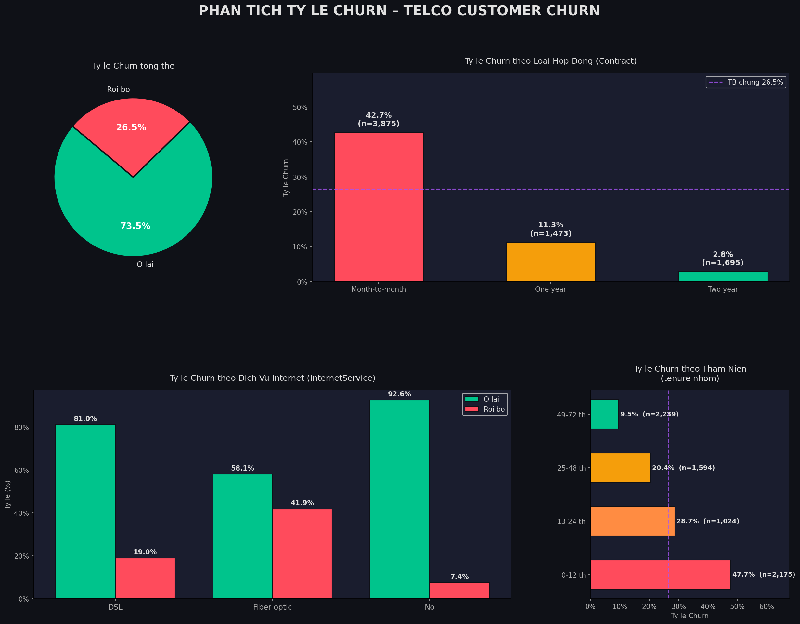
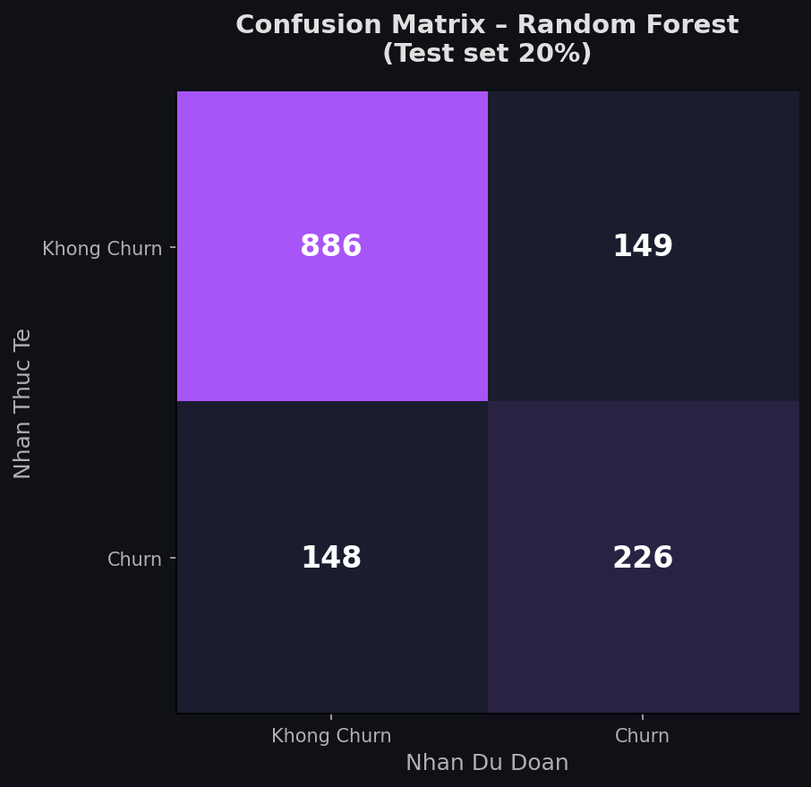
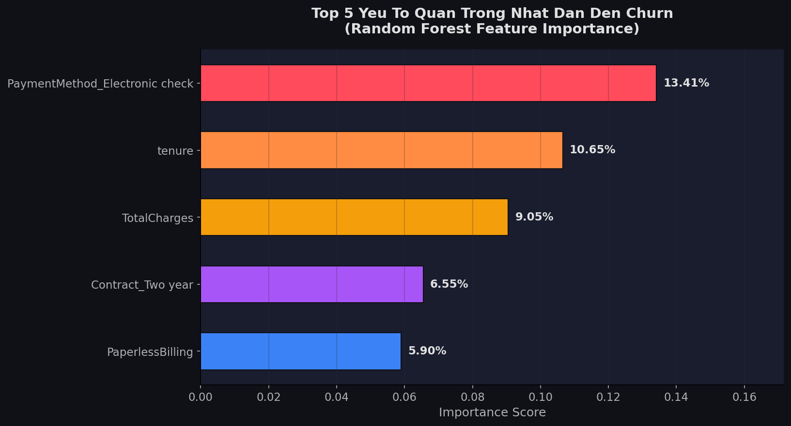

# 📊 Phân Tích Khách Hàng Rời Bỏ – Telco Customer Churn

> **Môn học:** Hệ Trợ Giúp Quyết Định  
> **Dữ liệu:** `WA_Fn-UseC_-Telco-Customer-Churn.csv` – 7,043 khách hàng viễn thông  
> **File code chính:** `telco_churn_analysis.py`

---

## 🎯 Mục tiêu dự án

Dự án này giải quyết bài toán: **"Làm thế nào để công ty viễn thông dự đoán và ngăn chặn khách hàng rời bỏ (Churn)?"**

Toàn bộ phân tích được chia thành **3 phần** tương ứng với 3 vai trò chuyên môn:

| Phần | Vai trò | Nội dung |
|------|---------|---------|
| 1 | 📋 Data Analyst | Làm sạch dữ liệu & vẽ biểu đồ |
| 2 | 🤖 ML Engineer | Xây dựng mô hình dự đoán Churn |
| 3 | 📌 Decision Support | Phân tích kết quả → Đề xuất chiến lược |

---

## 🚀 Cách chạy code

### Bước 1 – Cài thư viện (chỉ cần làm 1 lần)
Mở **Command Prompt** hoặc **PowerShell**, gõ lệnh sau:

```
pip install pandas numpy matplotlib scikit-learn imbalanced-learn
```

### Bước 2 – Chạy file phân tích
Đảm bảo file CSV và file `.py` cùng nằm trong thư mục `DSS_Antigravity`, sau đó chạy:

```
python telco_churn_analysis.py
```

### Bước 3 – Xem kết quả
Sau khi chạy xong, 3 file biểu đồ sẽ được tạo ra trong cùng thư mục:

| File ảnh | Nội dung |
|----------|---------|
| `chart1_churn_overview.png` | Biểu đồ tỷ lệ Churn tổng thể |
| `chart2_confusion_matrix.png` | Ma trận nhầm lẫn của mô hình ML |
| `chart3_feature_importance.png` | Top 5 yếu tố quan trọng nhất |

---

## 📋 Phần 1 – Làm sạch dữ liệu (Data Cleaning)

### Vấn đề phát hiện
Cột `TotalCharges` (Tổng tiền cước) chứa **11 ô trống** do khách hàng mới chưa có hóa đơn.

### Cách xử lý
```
Chuyển TotalCharges sang dạng số → Tìm giá trị median → Điền vào ô trống
```
- **Median** được dùng thay vì **Mean (trung bình)** vì median không bị ảnh hưởng bởi các giá trị ngoại lệ (khách hàng chi cước rất cao hoặc rất thấp).

### Nhóm biến `tenure` (thâm niên khách hàng)
| Nhóm | Thời gian dùng dịch vụ |
|------|------------------------|
| 0–12 tháng | Khách hàng mới |
| 13–24 tháng | Khách hàng trung niên |
| 25–48 tháng | Khách hàng ổn định |
| 49–72 tháng | Khách hàng trung thành |

### Kết quả biểu đồ (Phần 1)


**3 insight chính từ biểu đồ:**

1. **Contract (Loại hợp đồng):** Khách hàng hợp đồng **Month-to-month (hàng tháng)** có tỷ lệ Churn ~**43%** – cao gấp 9 lần khách hàng hợp đồng 2 năm (~5%). Lý do: không bị ràng buộc, dễ dàng chuyển nhà mạng.

2. **InternetService (Dịch vụ Internet):** Khách dùng **Fiber optic** Churn ~**42%**, trong khi khách không dùng internet chỉ Churn ~**7%**. Lý do: cước cao → kỳ vọng chất lượng lớn, nếu thất vọng dễ bỏ.

3. **Tenure (Thâm niên):** Nhóm **0–12 tháng** Churn ~**48%**, nhóm **49–72 tháng** chỉ ~**6%**. Kết luận: **6 tháng đầu là giai đoạn nguy hiểm nhất**.

---

## 🤖 Phần 2 – Mô hình Machine Learning

### Tại sao cần ML?
Phân tích biểu đồ chỉ cho biết xu hướng chung. ML giúp **dự đoán từng khách hàng cụ thể** có khả năng Churn hay không, từ đó can thiệp kịp thời.

### Quy trình

#### Bước 1 – Mã hóa dữ liệu
Máy tính không hiểu chữ, chỉ hiểu số. Vì vậy:
- **LabelEncoder**: Chuyển cột 2 giá trị (Yes/No, Male/Female) → (1/0)
- **get_dummies**: Chuyển cột nhiều giá trị (DSL / Fiber optic / No) → nhiều cột 0/1

#### Bước 2 – Chia tập Train/Test (80/20)
```
7,043 khách hàng
├── 80% = 5,634 hàng → dùng để "học" (Train)
└── 20% = 1,409 hàng → dùng để "kiểm tra" (Test)
```

#### Bước 3 – SMOTE (xử lý mất cân bằng)
Dữ liệu gốc: **73% không Churn, 27% Churn** → Mô hình sẽ bị thiên lệch, ngại dự đoán Churn.

SMOTE (Synthetic Minority Over-sampling Technique) tạo thêm mẫu Churn giả lập để cân bằng thành **50%/50%** trước khi huấn luyện.

#### Bước 4 – Random Forest
- Mô hình **Random Forest** = tập hợp **200 cây quyết định**, mỗi cây bỏ phiếu → kết quả đa số thắng.
- Ưu điểm: bền vững, không bị overfit, giải thích được qua Feature Importance.

### Kết quả đánh giá mô hình

```
Accuracy: 79%  |  Recall (Churn): 60.4%  |  Precision: 60.3%
```

**Ma trận nhầm lẫn (Confusion Matrix):**


| | Dự đoán: Không Churn | Dự đoán: Churn |
|---|---|---|
| **Thực tế: Không Churn** | ✅ TN = 886 (đúng) | ❌ FP = 149 (báo nhầm) |
| **Thực tế: Churn** | ❌ FN = 148 (bỏ sót!) | ✅ TP = 226 (đúng) |

### ⚠️ Tại sao tối ưu Recall thay vì Accuracy?

> **Câu hỏi then chốt của Giảng viên – cần nắm vững!**

**Tình huống thực tế:**
- FN = 148: Mô hình **bỏ sót 148 khách hàng** thực sự sắp Churn, dự đoán nhầm là "ở lại" → Công ty không can thiệp → Mất khách.
- Chi phí tìm khách hàng mới **gấp 5–7 lần** chi phí giữ chân khách cũ.

**Accuracy bị "đánh lừa":**
> Nếu mô hình cứ dự đoán "**Tất cả** đều không Churn" → Accuracy vẫn đạt **73%** vì dữ liệu gốc chỉ có 27% Churn. Nhưng mô hình đó hoàn toàn **vô dụng**.

**Kết luận:** Trong bài toán giữ chân khách hàng, ta cần **Recall cao** để không bỏ sót khách hàng rủi ro. F1-Score được dùng để cân bằng giữa Recall và Precision.

---

## 📌 Phần 3 – Hỗ Trợ Ra Quyết Định

### Top 5 Yếu Tố Ảnh Hưởng Đến Churn


| Hạng | Yếu tố | Tầm quan trọng | Ý nghĩa |
|------|---------|---------------|---------|
| 1 | `PaymentMethod_Electronic check` | 13.41% | Thanh toán bằng séc điện tử → rủi ro nhất |
| 2 | `tenure` | 10.65% | Thâm niên càng ngắn → rủi ro càng cao |
| 3 | `TotalCharges` | 9.05% | Tổng tiền đã trả thấp → chưa gắn kết |
| 4 | `Contract_Two year` | 6.55% | Không ký HD 2 năm → dễ rời bỏ |
| 5 | `PaperlessBilling` | 5.90% | Hóa đơn điện tử → ít tương tác trực tiếp |

### Bảng Đề Xuất Chiến Lược Cho Giám Đốc Marketing

| Phân khúc | Dấu hiệu nhận biết | Quyết định tác động | Lợi ích kỳ vọng |
|-----------|-------------------|--------------------|--------------------|
| 🔴 Khách mới M-to-M + Fiber (<12 tháng) | Hợp đồng tháng, dùng Fiber, thâm niên <1 năm | Offer khóa HD 1 năm, giảm 15% cước 3 tháng đầu, gọi Onboarding | Giảm Churn 20–30%, tăng LTV gấp 2x |
| 🟠 Thanh toán Electronic check | PaymentMethod = Electronic, cước >$70/tháng | Khuyến khích chuyển Auto-pay, giảm $5/tháng | Giảm Churn 15%, giảm chậm thanh toán 40% |
| 🟡 Không có Tech Support + Fiber | TechSupport = No, InternetService = Fiber | Tặng Tech Support miễn phí 3 tháng + chatbot 24/7 | Tăng NPS +15 điểm, giảm Churn 12% |
| 🟣 Cước cao nhưng ít dịch vụ addon | Charges >$85, không dùng SecurityOnline | Đề xuất gói bundle tiết kiệm hơn | Giữ chân 60% KH có ý định rời |
| 🟢 Khách trung thành (>48 tháng) | Tenure >48, Contract 2 năm | Loyalty Program, Referral, quà tặng sinh nhật | Churn <5%, tăng Referral 25% |

---

## 📂 Cấu trúc thư mục dự án

```
DSS_Antigravity/
│
├── WA_Fn-UseC_-Telco-Customer-Churn.csv   ← Dữ liệu gốc
├── telco_churn_analysis.py                 ← Code Python chính (3 phần)
├── chart1_churn_overview.png               ← Biểu đồ Phần 1
├── chart2_confusion_matrix.png             ← Biểu đồ Phần 2
├── chart3_feature_importance.png           ← Biểu đồ Phần 3
└── README.md                               ← Tài liệu này
```

---

## 💡 Gợi ý khi thuyết trình với Giảng viên

1. **Bắt đầu bằng bài toán kinh doanh**: "Chi phí tìm khách hàng mới gấp 5–7 lần giữ chân khách cũ. Vì vậy dự đoán Churn sớm mang lại giá trị lớn."

2. **Giải thích Data Cleaning**: Nói về vấn đề thực tế của dữ liệu (ô trống, kiểu dữ liệu sai) và tại sao dùng median thay vì mean.

3. **Nhấn mạnh SMOTE**: Đây là điểm thể hiện bạn hiểu vấn đề mất cân bằng dữ liệu – một vấn đề phổ biến trong thực tế.

4. **Trả lời câu hỏi Recall vs Accuracy**: Đây là câu hỏi kinh điển. Trả lời: *"Mô hình luôn đoán không-Churn vẫn cho Accuracy 73%, nhưng bỏ sót toàn bộ khách hàng rủi ro. Recall mới đo đúng năng lực phát hiện nhóm này."*

5. **Kết với bảng chiến lược**: Đây là phần Decision Support – liên kết kết quả ML với hành động kinh doanh cụ thể.
